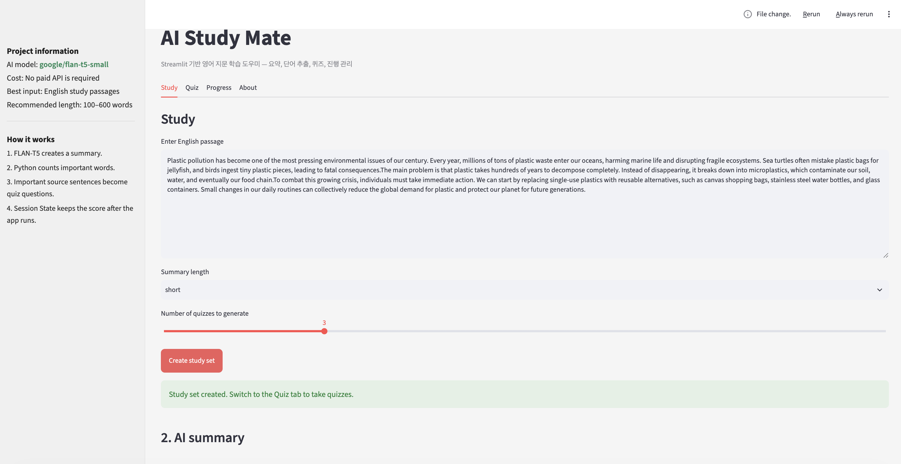

# AI Study Mate

> Streamlit 기반 영어 지문 학습 도우미

AI Study Mate는 영어 지문을 입력하면 요약, 핵심 단어 추출, 빈칸 채우기 퀴즈 생성, 학습 진행 추적까지 한 번에 제공하는 로컬형 학습 앱입니다. 영어 독해 연습을 빠르게 시작할 수 있도록 설계되었으며, 별도의 유료 API 없이도 로컬 환경에서 동작하도록 구성되어 있습니다.

## 프로젝트 소개

이 프로젝트는 다음 흐름으로 동작합니다.

1. 사용자가 영어 지문을 입력합니다.
2. AI 모델이 지문을 요약합니다.
3. 핵심 단어를 추출해 학습 포인트를 보여줍니다.
4. 문장에서 중요한 단어를 뽑아 빈칸 퀴즈를 생성합니다.
5. 사용자가 답을 입력하고 채점하며, 성적과 진행 기록을 저장합니다.

## 주요 기능

### 1) 영어 지문 요약
- 입력한 영어 글을 분석해 요약문을 생성합니다.
- 요약 길이를 `short`, `medium`, `detailed`로 선택할 수 있습니다.
- 지문은 최소 40단어 이상이어야 합니다.
- 40단어 미만이면 경고 메시지를 출력하고 생성하지 않습니다.

### 2) 핵심 단어 추출
- 문장에서 자주 등장하는 단어를 추출합니다.
- `STOPWORDS`를 제외하고, 상위 8개 키워드를 보여줍니다.
- 순수 Python 로직으로 단어 빈도 계산을 수행합니다.

### 3) 빈칸 퀴즈 생성
- 문장을 랜덤으로 선택하고, 중요한 단어를 빈칸으로 바꿔 문제를 만듭니다.
- 생성 개수는 사용자가 조절할 수 있습니다.
- 정답은 대소문자를 구분하지 않고 비교합니다.
- 정답 확인 후 정답 리뷰와 점수를 제공합니다.

### 4) 학습 진행 관리
- 완료한 퀴즈 수, 최근 점수, 최고 점수를 표시합니다.
- 점수 변화 그래프를 보여줍니다.
- `Clear progress` 버튼을 누르면 진행 데이터를 초기화할 수 있습니다.

## 기술 스택

- Python
- Streamlit
- Hugging Face Transformers
- PyTorch
- Pandas

## AI 모델

기본적으로 다음 모델을 사용합니다.

- `google/flan-t5-small`

모델 로딩에 실패하는 경우, 앱은 자동으로 문장 점수 기반의 fallback 요약 방식을 사용해 기능을 유지합니다.

## 설치 방법

Python 3.8 이상 환경에서 아래 명령으로 의존성을 설치합니다.

```bash
pip install -r requirements.txt
```

## 실행 방법

프로젝트 루트에서 다음 명령을 실행합니다.

```bash
streamlit run app.py
```

실행 후 브라우저에서 앱이 열리면 다음 순서로 사용할 수 있습니다.

1. `Study` 탭에서 영어 지문을 입력합니다.
2. 요약 길이와 퀴즈 개수를 선택합니다.
3. `Create study set` 버튼을 누릅니다.
4. 생성된 요약과 키워드를 확인합니다.
5. `Quiz` 탭으로 이동해 문제를 풀고 채점합니다.
6. `Progress` 탭에서 학습 기록을 확인합니다.

## UI 화면 구성

앱은 다음과 같은 구조로 구성되어 있습니다.

- 왼쪽 사이드바: 프로젝트 정보, AI 모델 정보, 동작 방식 안내
- 상단 탭: `Study`, `Quiz`, `Progress`, `About`
- 메인 영역: 입력한 영어 지문을 요약하고 핵심 단어와 퀴즈를 생성하는 화면

아래와 같은 흐름을 가진 화면이 실제로 구현되어 있습니다.

1. `Study` 탭에서 지문 입력
2. 요약 길이 선택
3. 퀴즈 수 조절
4. `Create study set` 버튼으로 결과 생성
5. AI summary, 키워드 카드, 퀴즈 준비 완료 안내 표시



> 위 이미지는 앱의 핵심 화면 구성을 보여주는 예시이며, 실제 실행 화면은 텍스트 입력 내용과 데이터에 따라 다르게 표시됩니다.

## 프로젝트 구조

```text
AI_studymate/
├── app.py
├── README.md
├── requirements.txt
├── SDD.md
├── progress.json
└── .cache/
```

- `app.py`: 메인 Streamlit 애플리케이션
- `requirements.txt`: 프로젝트 의존성
- `progress.json`: 학습 점수 기록 저장 파일
- `SDD.md`: 프로젝트 설계 문서

## 사용 팁

- 학습 효과를 높이려면 100~600단어 정도의 영어 지문을 입력하는 것이 좋습니다.
- 짧은 문장 위주 지문은 요약과 퀴즈 생성 품질이 떨어질 수 있습니다.
- 모델이 처음 로드될 때는 시간이 조금 걸릴 수 있습니다.

## 참고

이 앱은 영어 학습 보조 도구로서, 문장 이해와 어휘 학습을 돕는 데 초점을 두고 있습니다. 단순한 AI 요약 기능뿐 아니라, 실제 학습 흐름을 반영한 퀴즈와 성과 관리 기능이 포함되어 있습니다.

## 라이선스

본 프로젝트는 별도의 라이선스 문구가 지정되지 않은 경우, 프로젝트 소유자에 따라 개별적으로 관리됩니다.
